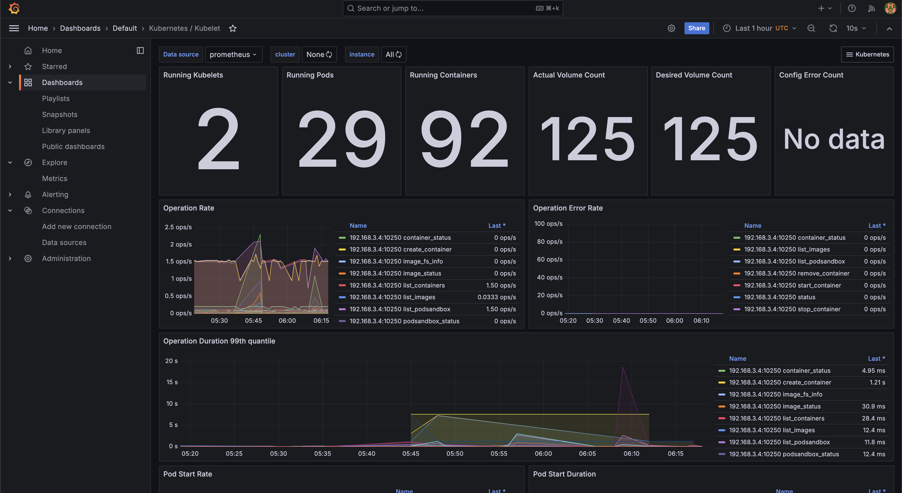

This is a k8s manifest repository for my home raspberry pi k3s cluster.

argocd: https://argocd.cheesena.dev

prometheus: https://prometheus.cheesena.dev

alertmanager: https://alertmanager.cheesena.dev

grafana: https://grafana.cheesena.dev

Images

### How to deploy

1. Set up kubernetes cluster
2. Clone the repository
3. `k apply -k .`
4. Go to argocd UI and sync if needed

### note

These manifests are supposed to be deployed on a k3s cluster.
In the case of using a different cluster or using ingress controller other than traefik, you may need to modify the manifests.
